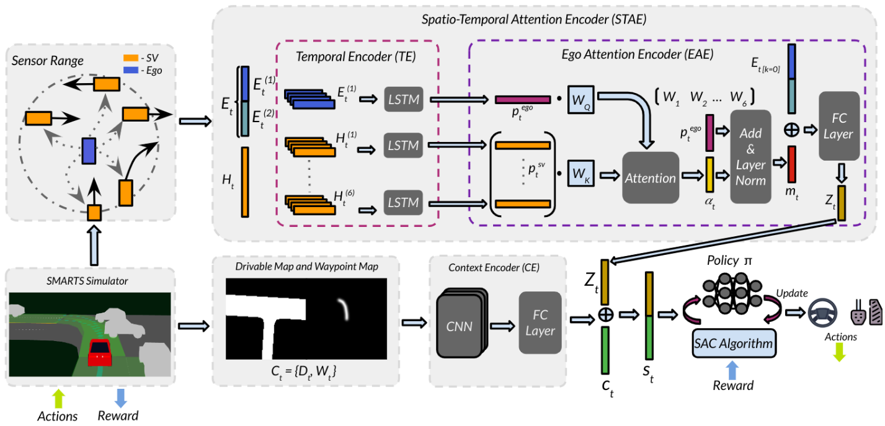

## Deep Attention Driven Reinforcement Learning (DAD-RL) for Autonomous Decision-Making in Dynamic Environment (Published at IEEE International Conference on Systems, Man and Cybernetics 2024)

- **Paper link: [Deep Attention Driven Reinforcement Learning (DAD-RL) for Autonomous Decision-Making in Dynamic Environment](https://arxiv.org/abs/2407.08932)**
- Further updates are coming soon.
# Cite this work
If you find DAD-RL useful in your research, please cite the [paper](https://arxiv.org/abs/2407.08932). In BibTeX format:

```bibtex
@INPROCEEDINGS{10832016,
  author={Chowdhury, Jayabrata and Shivaraman, Venkataramanan and Dangi, Sumit and Sundaram, Suresh and Sujit, P B},
  booktitle={2024 IEEE International Conference on Systems, Man, and Cybernetics (SMC)}, 
  title={Deep Attention Driven Reinforcement Learning (DAD-RL) for Autonomous Decision-Making in Dynamic Environment}, 
  year={2024},
  volume={},
  number={},
  pages={3863-3868},
  keywords={Heuristic algorithms;Decision making;Reinforcement learning;Transformers;Feature extraction;Encoding;Spatiotemporal phenomena;Trajectory;Safety;Vehicle dynamics},
  doi={10.1109/SMC54092.2024.10832016}}
